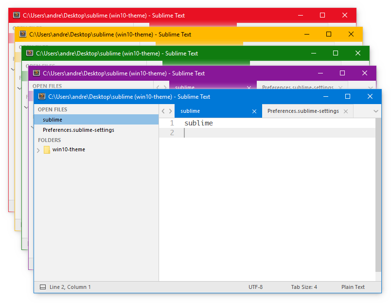
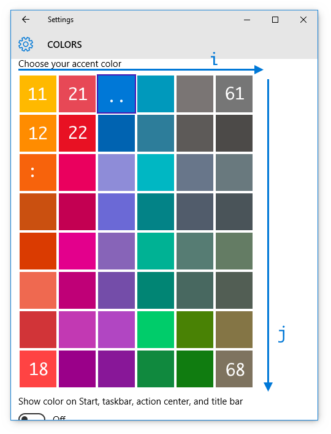
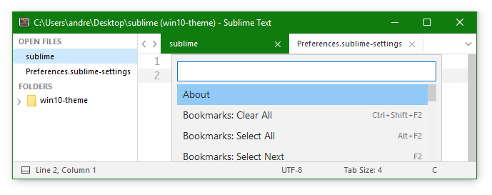
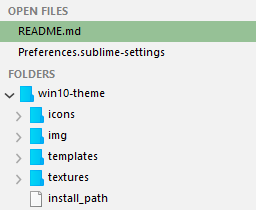

# Windows 10 Theme for Sublime Text 3

Windows 10 inspired light theme for Sublime Text 3.




## Instalation

### Manual installation

* Download the files using GitHub's `Donwload ZIP` function
* Unzip the files and rename the folder to `Theme - Windows 10`
* Find your `Packages` directory using the menu item  `Preferences` > `Browse Packages...`
* Copy the folder into your Sublime Text `Packages` directory


## Activate the theme

Activate the theme by setting the following entries in your settings file (`Preferences` > `Settings User`):
```json
	"theme"       : "Windows 10.sublime-theme",
	"color_scheme": "Packages/Theme - Windows 10/Widget - Windows 10.tmTheme",
```


## Configure the theme


### Overview

```json
{
	"theme"       : "Windows 10.sublime-theme",
	"color_scheme": "Packages/Theme - Windows 10/Widget - Windows 10.tmTheme",

	"theme_accent_color_58"        : true,
	"theme_default_selection_color": true,
	"theme_default_toggle_color"   : true,
	"theme_lightgray_sidebar"      : true,
	"theme_blue_folders"           : true,
}
```

### Accent colors

It is recommended to select one of the predefined accent colors from the `Settings` app > `Personalisation` > `Colors`, and turn on the `Show color on title bar` feature. Additionally Sublime's menu can be hidden selecting `View` > `Hide Menu` (press `Alt` when you need to use the menu again).




#### Setting the accent color

Select the theme's accent color by setting `theme_accent_color_<i><j>` to `true` where `i` and `j` are the color's column and row number in the settings panel as pictured above.

e.g. `"theme_accent_color_58": true,`


#### Selection color

Set `theme_default_selection_color` to use a default explorer styled color for selected items instead of the chosen accent color.

`"theme_default_selection_color": true,`




#### Toggle buttons color

To better distinguish the toggle status of the panel buttons with certain accent colors, an option has been included for using the default blue color instead of the chosen accent color.

`"theme_default_toggle_color": true,`


### Light gray sidebar

`"theme_lightgray_sidebar": true,`


### Blue folder icons

`"theme_blue_folders": true,`


